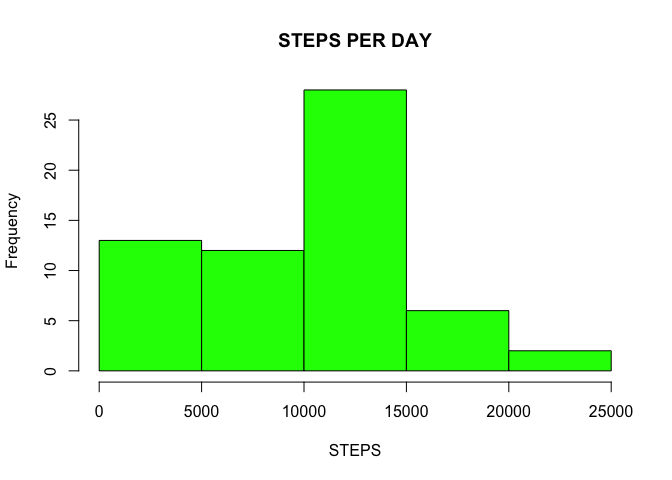
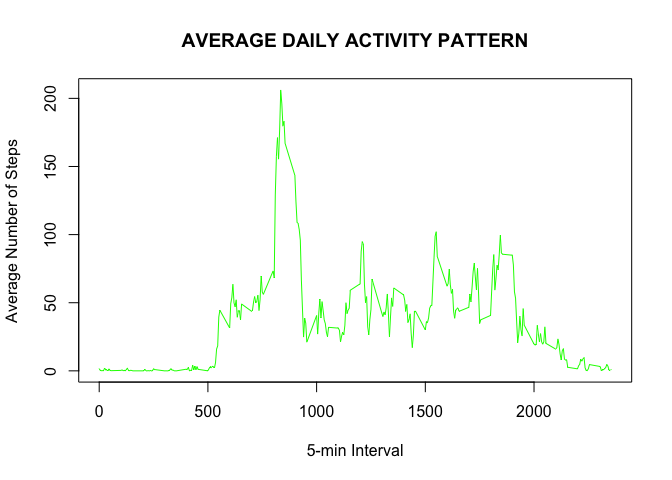
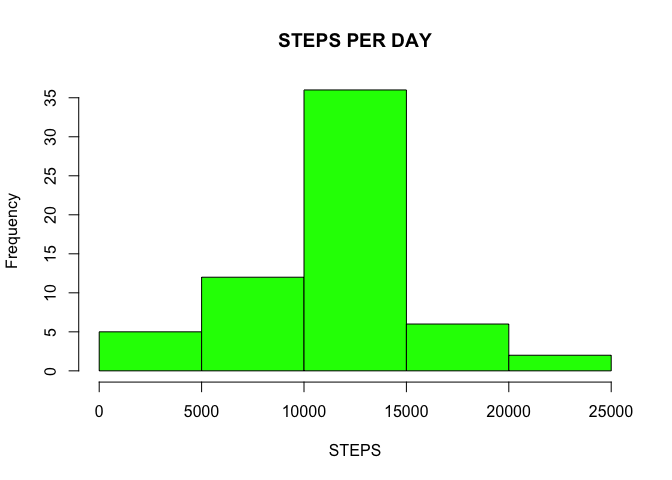
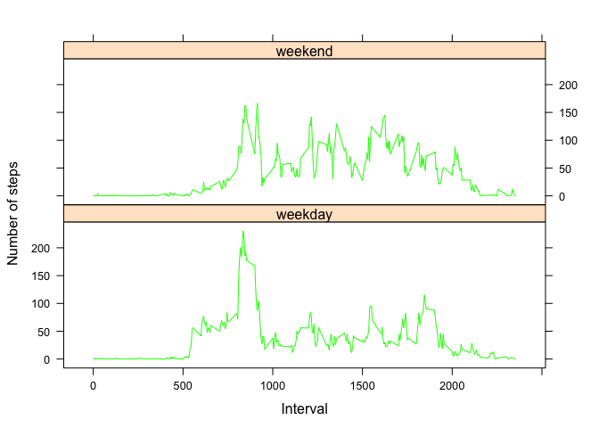

# Reproducible Research: Peer Assessment 1


## Loading and preprocessing the data

```r
setwd("~/Desktop/RepData_PeerAssessment1")
unzip(zipfile = "activity.zip")
activity <- read.csv("activity.csv", header = T, sep = ",")
```

## What is mean total number of steps taken per day?
we have to sum the steps per day


```r
step_day <- tapply(activity$steps, activity$date, sum, na.rm=T)
```

The we can plot the histogram


```r
hist(step_day, xlab = "STEPS", main = "STEPS PER DAY", col="green")
```



MEAN

```r
mean(step_day)
```

```
## [1] 9354.23
```

MEDIAN

```r
median(step_day)
```

```
## [1] 10395
```

## What is the average daily activity pattern?

Time series plot 


```r
mean_interval <- tapply(activity$steps, activity$interval, mean, na.rm=T)
plot(mean_interval ~ unique(activity$interval), type="l", xlab = "5-min Interval", ylab = "Average Number of Steps", main = "AVERAGE DAILY ACTIVITY PATTERN",  col ="green")
```



The 5-minute interval that, on average, contains the maximum number of steps

```r
mean_interval[which.max(mean_interval)]
```

```
##      835 
## 206.1698
```

## Imputing missing values

Number of NAs in steps, date and interval variables

```r
sum(is.na(as.character(activity$steps)))
```

```
## [1] 2304
```

```r
sum(is.na(as.character(activity$date)))
```

```
## [1] 0
```

```r
sum(is.na(as.character(activity$interval)))
```

```
## [1] 0
```

We can use the mean to fill in the missing value

```r
activity_complete <- activity  # creation of the dataset that will have no more NAs
for (i in 1:nrow(activity)){
  if(is.na(activity$steps[i])){
    activity_complete$steps[i]<- mean_interval[[as.character(activity[i, "interval"])]] }}
```

## Histogram of the total number of steps taken each day after missing values are imputed


```r
step_day_complete <- tapply(activity_complete$steps, activity_complete$date, sum, na.rm=T)
hist(step_day_complete, xlab = "STEPS", main = "STEPS PER DAY", col="green")
```



## Are there differences in activity patterns between weekdays and weekends?

Creating a data frame with a new variable "workday"

```r
workday <- as.character()
day <- weekdays(as.Date(activity_complete$date))
workday[which(day == "Sabato" | day == "Domenica")]  <- "weekend"
workday[which(day == "Lunedì" | day == "Martedì" | day == "Mercoledì"| day == "Giovedì" | day == "Venerdì")]  <- "weekday"
data <- data.frame(activity_complete,workday)
```

Subsetting data frame in weekend and weekday

```r
data_weekend <- subset(data, data$workday == "weekend")
data_weekday <- subset(data, data$workday == "weekday")
```

Calculating mean in the weekend and weekday

```r
mean_interval_weekend <- tapply(data_weekend$steps, data_weekend$interval, mean, na.rm=T)
mean_interval_weekday <- tapply(data_weekday$steps, data_weekday$interval, mean, na.rm=T)
```

Creating data frames averaged across all weekday days or weekend days

```r
weekday <- data.frame(interval = unique(data_weekday$interval), avg = as.numeric(mean_interval_weekday), day = rep("weekday", length(mean_interval_weekday)))
weekend <- data.frame(interval = unique(data_weekend$interval), avg = as.numeric(mean_interval_weekend), day = rep("weekend", length(mean_interval_weekend)))
data <- rbind(weekday, weekend)
```

Plotting with lattice system

```r
library(lattice)
xyplot(avg ~ interval | day, data = data, layout = c(1, 2), type = "l", xlab = "Interval", ylab = "Number of steps", col="green")
```




